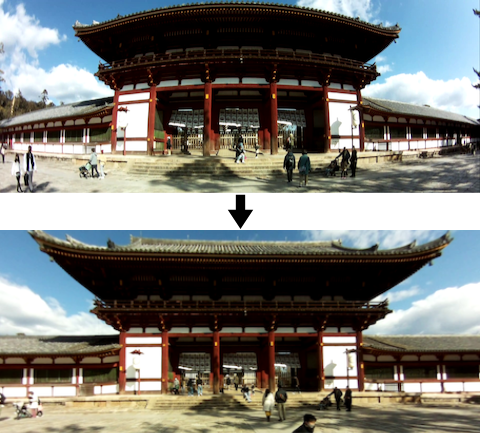

# Remapvid

Remapvid performs real-time video remapping on Raspberry Pi.  
Remapping is a pixel to pixel mapping technique which could be used for correcting lens distortion, rectifying fisheye, or even applying distortion to image.  
Remapvid allows you to remap the images captured by Raspberry Pi camera on the fly and outputs the remapped images as video encoded in H264, so you can use it as a live stream source.

[Example Video](https://www.youtube.com/watch?v=znkMd5O7y7M)



The remapping process is executed on the GPU of Raspberry Pi (VideoCore IV). The GPU kernel code is assembled using [py-videocore](https://github.com/nineties/py-videocore).

## Features

- Video remapping
  - Distortion effect
  - Lens distortion correction
  - Fisheye rectification
  - Equirectangular projection of dual fisheye
  - and other custom mappings
- Real-time processing
  - Framerate could be up to 30fps at 1080p
- H264 video output

## Requirements

- Raspberry Pi with VideoCore IV GPU
  - 1, 2, 3, zero, or zero 2
  - __4 is not currently supported__
- Raspberry Pi Camera Module
  - 1, 2, HQ, and compatibles
  - __USB camera is not currently supported__
- Raspberry Pi OS (32bit)
  - Buster
  - Bullseye
- Python 3
  - setuptools
  - NumPy
  - ioctl-opt
- Meson

## Installation

### Build requirements

```bash
sudo apt install python3-pip python3-numpy meson
pip3 install ioctl-opt
```

### userland (only needed for Raspberry Pi OS Bullseye)

```bash
sudo apt install cmake
git clone https://github.com/raspberrypi/userland.git
cd userland
./buildme
```

### Remapvid

```bash
git clone --recursive https://github.com/tkman33/remapvid.git
cd remapvid
meson build
ninja -C build
```

## Configuration

To run Remapvid, you need to configure GPU settings by editing `/boot/config.txt` like below and reboot to apply these settings.

```bash
# Disable libcamera stack. Comment out "camera_auto_detect=1" if it exists.
#camera_auto_detect=1

# Use legacy GL driver. Comment out "dtoverlay=vc4-fkms-v3d" if it exists.
#dtoverlay=vc4-fkms-v3d

# Enable legacy camera stack.
start_x=1

# Reserve GPU memory. (128 or more)
gpu_mem=128

# (Optional) Enable force turbo mode to get better performance.
force_turbo=1

# (Optional) Overclock SDRAM to get better performance.
# Note that it may causes system instability if SDRAM clock speed is too high.
sdram_freq=600
```

## Running example

### Recording remapped video to file

```bash
cd remapvid
./build/remapvid --map examples/crystal-ball_1920x1080.map --output remapped.h264
```

Press <kbd>Ctrl</kbd>+<kbd>C</kbd> to stop.

### Streaming remapped video to remote machine

Install GStreamer on Raspberry Pi.

```bash
sudo apt install gstreamer1.0-tools gstreamer1.0-plugins-good gstreamer1.0-plugins-bad gstreamer1.0-libav
```

Install GStreamer on remote machine (in case of macOS).

```bash
brew install gstreamer gst-plugins-base gst-plugins-good gst-plugins-bad gst-libav
```

Run GStreamer on remote machine.

```bash
video_stream_port=[port number of your remote machine (e.g. 9000)]
gst-launch-1.0 -v udpsrc port=$video_stream_port caps='application/x-rtp, media=(string)video, clock-rate=(int)90000, encoding-name=(string)H264' ! rtph264depay ! avdec_h264 ! videoconvert ! autovideosink sync=false
```

Run GStreamer on Raspberry Pi.

```bash
remote_addr=[ip address of your remote machine (e.g. 192.168.1.10)]
video_stream_port=[port number of your remote machine (e.g. 9000)]
./build/remapvid --map examples/crystal-ball_1920x1080.map --bitrate 5000000 | gst-launch-1.0 -v fdsrc ! h264parse ! rtph264pay config-interval=10 pt=96 ! udpsink host=$remote_addr port=$video_stream_port
```

## Performance

The maximum framerate depends on the map to use. The larger the size of the map is, the lower the framerate will be.  
Remapping is memory-intensive process, so you might not be able to get 30fps@1080p unless you overclock SDRAM.  
Here is the result of measuring framerate under some conditions for reference.

- Video resolution: 1920x1080
- SDRAM clock speed under turbo condition
  - Zero: 550 MHz
  - Zero 2: 600 MHz
- Measuring command
```bash
./build/remapvid --map [path-to-map-file] --bitrate 10000000 | ffmpeg -re -f h264 -framerate 30 -i - -vcodec copy -f mp4 /dev/null
```

### Fisheye Rectification

`examples/fisheye-rect_1920x1080.map`

| Cond.  | Zero   | Zero 2 |
|--------|--------|--------|
| normal | 25 fps | 25 fps |
| turbo  | 30 fps | 30 fps |

### Crystal Ball Effect

`examples/crystal-ball_1920x1080.map`

| Cond.  | Zero   | Zero 2 |
|--------|--------|--------|
| normal | 20 fps | 20 fps |
| turbo  | 24 fps | 28 fps |

## Creating custom map

You can create a custom map file for Remapvid from two files containing x and y mapping matrices respectively.

```bash
python3 tools/convert_maps.py --map-width 1920 --map-height 1080 --map-x map_x.dat --map-y map_y.dat --output remapvid_1920x1080.map
```

Please refer to [OpenCV tutorial](https://docs.opencv.org/4.5.1/d1/da0/tutorial_remap.html) for creating the mapping matrices.  
The type of these matrices must be `CV_F32C1`.